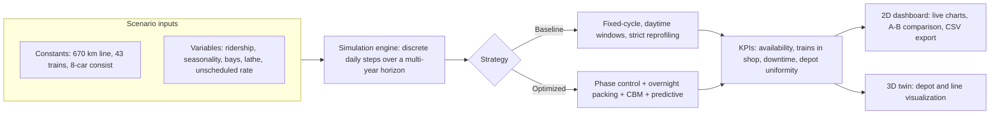
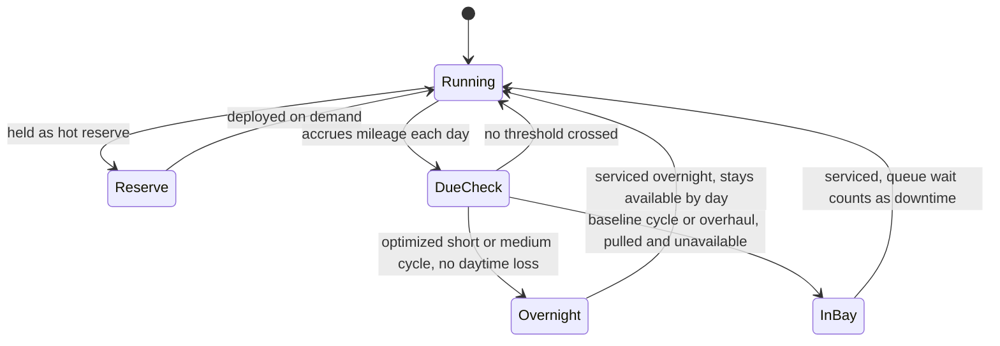

# EVS360 High-Speed Rail Fleet Maintenance Digital Twin

A browser-based **digital twin** that simulates the maintenance and availability of a 43-train
high-speed rail fleet, and shows that a smarter maintenance plan lifts fleet availability from
**~85% to ~95%** using the same depot and the same trains. Ships as two self-contained HTML files:
an interactive 2D analysis dashboard and a live 3D depot simulation.

Built for the International Transport Project Competition (Problem #6, JSC High-Speed Services /
EVS360 trains, Moscow to St. Petersburg line).


-blue)

-success)


---

## Table of contents
- [What this demonstrates](#what-this-demonstrates)
- [Live demo and quick start](#live-demo-and-quick-start)
- [The problem](#the-problem)
- [The approach](#the-approach)
- [Results](#results)
- [How it works](#how-it-works)
- [Engineering and validation](#engineering-and-validation)
- [Tech stack](#tech-stack)
- [Project structure](#project-structure)
- [Run and re-validate locally](#run-and-re-validate-locally)
- [Modelling assumptions](#modelling-assumptions)
- [Roadmap](#roadmap)

---

## What this demonstrates

This project pulls together several disciplines in one self-contained artifact:

- **Operations research / simulation modelling.** A discrete-time simulation of a whole fleet over
  a multi-year horizon, modelling nested maintenance cycles, a single-server bottleneck (the wheel
  lathe), finite depot capacity, queueing, stochastic breakdowns, and a staggered fleet roll-out.
- **Systems thinking.** Reframing the task from "schedule maintenance around operations" to
  "co-design operations and maintenance so depot demand arrives smoothly and lands in idle windows."
- **Data visualization and front-end engineering.** A dependency-free 2D dashboard with custom
  canvas charts, and a 3D real-time visualization in Three.js / WebGL.
- **Engineering discipline.** An automated validation harness, a headless UI smoke test, and a
  documented debugging trail where counter-intuitive results were traced to modelling bugs and fixed.

Everything runs client-side. No server, no build step, no account.

## Live demo and quick start

**Easiest:** download `index.html` (2D) or `depot-3d.html` (3D) and double-click to open in any
browser. `index.html` works fully offline.

**Hosted (optional):** enable GitHub Pages (repo Settings to Pages to Deploy from `main`), then:
- 2D dashboard: `https://mulengachilufya.github.io/3D-digital-twin-for-43-trains-railway-competition/`
- 3D simulation: same URL with `/depot-3d.html`

## The problem

High-speed rail imposes far stricter availability requirements than conventional rail. The operator
wants every train carrying passengers; the service company must still pull trains out regularly for
mandatory maintenance. With a 43-train fleet each running ~900,000 km/year, a single depot, and a
hard requirement to keep **at least 89% of the fleet available at all times**, those two goals
collide. Maintenance is triggered by mileage and the cycles are nested:

| Cycle | Trigger | Downtime |
|---|---|---|
| IS100 inspection | every 12,500 km | ~2 hours |
| IS200 to IS540 | larger mileage thresholds | hours to tens of hours |
| IS600 / IS700 overhauls | 1.2 M km / 2.4 M km | weeks |
| Wheel reprofiling | every 200,000 km | single tandem lathe, ~1.2 h/bogie |

The brief explicitly rules out the easy answers (bigger reserve fleet, redesigned trains, fewer
maintenance activities, bending the timetable) and asks for a planning model, validated by
simulation against the traditional fixed-cycle scheme.

## The approach

The solution is framed as three complementary ideas, each attacking a different leverage point:

1. **First principles** - *mileage phase control* (stagger when each train becomes due so depot
   arrivals are smooth rather than bursty) plus *overnight service-block packing* (do routine cycles
   in the 00:00 to 06:00 idle window, where they cost zero daytime availability), with a
   queueing-theory bound on the minimum depot capacity needed to hold 89%.
2. **Modern tech** - a digital twin fed by telematics, *condition-based reprofiling* (cut wheels on
   actual wear instead of a fixed 200,000 km, which unclogs the single-lathe bottleneck), and a
   rolling-horizon optimizer.
3. **AI** - *predictive* capture of unscheduled failures (turning the random ~30% unscheduled load
   into planned work) and a reinforcement-learning scheduling policy.

**What this repository implements:** a faithful simulation of the **Baseline** fixed-cycle scheme
versus an **Optimized** plan that applies the four deployable levers above (phase control, overnight
packing, condition-based reprofiling, predictive capture), each individually toggleable. The
rolling-horizon optimizer and the RL policy are part of the written proposal, not claimed as code
here. The point of the twin is to **quantify and visualize** the gap.

## Results

Default scenario, identical depot and demand for both strategies, 5-year horizon, steady-state
window (after fleet roll-up):

| Metric | Baseline (current) | Optimized twin |
|---|---|---|
| Mean operational availability | ~85% | **~95%** |
| Share of days meeting 89% | ~25% | **~95%** |
| Peak trains in the shop at once | ~23 | **~9** |
| Average downtime per maintenance event | ~0.7 days | **~0.2 days** |

**The headline finding (robust to bay count):** the all-daytime baseline **plateaus at ~85% no
matter how many bays you add**, because the binding constraint is the number of *daytime hours*
available to do routine work, not the number of bays. The optimized twin recovers ~10 points of
availability by moving routine cycles into the night. This is the kind of result a reviewer cannot
dismiss as "you just gave the baseline too few resources."

Technique isolation (turn one lever on at a time) shows each targets a different KPI: overnight
packing lifts the mean, phase control roughly doubles the share of compliant days by smoothing
arrivals, condition-based reprofiling frees the lathe bottleneck, and prediction absorbs the
unscheduled load.

## How it works



The core is a pure simulation function (`runSim`) with no DOM dependencies, so it can be unit-tested
in Node and reused by both front-ends. Each train is modelled as a state machine driven by
accumulated mileage:



Maintenance hours are accounted fractionally (a 2-hour inspection costs ~2 hours of availability,
not a whole day). A train is **pulled when it becomes due** and is unavailable until serviced, so a
bay shortage correctly *lowers* availability and deferring maintenance is never free. Overnight work
in the optimized plan consumes night capacity but does not pull the train from daytime service,
which is the entire mechanism behind the availability gain.

## Engineering and validation

A model that only ever confirms its own conclusion is worthless, so the engine is tested and was
explicitly hardened against several wrong-but-plausible early versions:

- **Automated engine test** (`_enginetest.cjs`): extracts the live `runSim` from the HTML, runs
  baseline vs optimized plus technique-isolation and stress scenarios, and asserts the baseline
  stays in a credible band (it must not be a rigged strawman).
- **Headless UI smoke test** (`_uitest.cjs`): runs the entire browser script under stubbed DOM and
  canvas objects to catch broken element ids or any throw inside the render path, without a browser.
- **Bugs found and fixed during development** (documented because the reasoning is the point):
  - a first version counted every short inspection as a full lost day, collapsing the baseline to a
    non-credible 52%; fixed with fractional hour-based accounting.
  - a later version let trains keep running while waiting for a bay, so *fewer* bays paradoxically
    improved availability; fixed by pulling trains at the due point so queue waiting counts as
    downtime.
  - an early "balance the mileage" baseline synchronized the whole fleet into one giant clustered
    failure; replaced with a neutral rotation so the comparison is fair and the gain is attributable
    to maintenance planning, not a sabotaged roster.

Every constant from the brief and every modelling assumption is either a slider or documented in the
app, so the whole model is auditable.

## Tech stack

- **Vanilla JavaScript** (ES2017+), no framework, no bundler.
- **HTML5 Canvas** for the 2D charts, hand-rolled (zero charting dependencies).
- **Three.js (WebGL)** for the 3D depot and line simulation, with a hand-written orbit camera.
- **Node.js** for the validation harnesses.
- Single-file, dependency-free distribution (the 2D twin has no runtime dependencies at all).

## Project structure

```
.
|-- index.html        2D digital twin: dashboard, KPIs, charts, A/B comparison, CSV export
|-- depot-3d.html     3D simulation: live depot + line, trains, hot reserve, availability HUD
|-- _enginetest.cjs   Node: simulation engine validation + stress tests
|-- _uitest.cjs       Node: headless UI smoke test (stubbed DOM/canvas)
|-- _serve.cjs        Node: tiny static server for local preview (optional)
|-- README.md
```

## Run and re-validate locally

No build step. To open: double-click `index.html` or `depot-3d.html`.

To re-run the validation (requires Node):

```bash
node _enginetest.cjs   # engine: baseline vs optimized, isolation, stress, assertions
node _uitest.cjs       # UI: loads the full browser script headlessly and checks render
```

To preview over a local server instead of file://:

```bash
node _serve.cjs        # then open http://localhost:5599
```

## Modelling assumptions

Fixed by the brief: 670 km line, 43 trains, 8-car fixed consist, 4 hot reserve, IS100 every
12,500 km / 2 h, IS600 at 1.2 M km, IS700 at 2.4 M km, reprofiling every 200,000 km on one tandem
lathe (1.2 h/bogie), availability >= 89%, roll-out of 6 trains in Q2 2028 then +1/month, ~900,000
km/train/year.

Assumptions exposed as sliders or documented in-app (calibrate to real data when available):
IS200/IS510 to IS540 periods and durations, seats per train, load factor, depot bay count,
overnight-window length (6 h), maximum hideable job (72 h), condition-based wear factor, and
predictive capture rate.

## Roadmap

- Vendor Three.js into the 3D file so it runs fully offline.
- Add a depot Gantt view and an explicit hot-reserve swap animation.
- Add a small optimizer that finds the minimum depot footprint (bays + lathes) that still holds 89%.
- Replace the rules-based optimized plan with a learned (reinforcement-learning) scheduling policy.

---

*Interactive operations-research simulation and visualization. Built with a focus on a credible,
auditable model and a clear, shareable result.*
